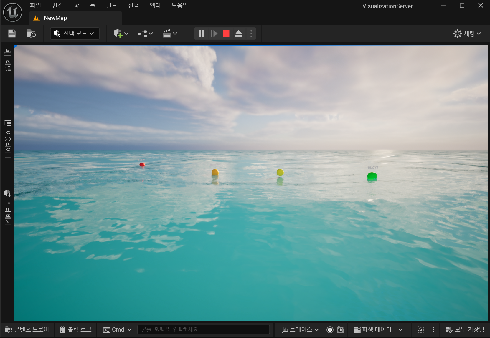

# Visualization Server (Unreal Engine 5)

**Unreal Engine 5** project that displays real-time wave and buoy information in a 3D environment.

This server listens for incoming JSON data from the **Digital Twin Server** and updates the visual state of buoy actors accordingly.

---

## 📜 Overview
- **TwinDeviceServer**: A TCP server actor that listens on a specified port (default `10002`).
- **TwinDeviceActor**: A 3D actor that represents a buoy in the virtual scene, updating position and color based on danger level.
- **Integration**: Data is received as JSON, which includes `deviceName`, `dangerState`, `gps` info, etc.



---

## 🚀 How to Build & Run

### 1. Requirements
- Unreal Engine 5.x
- Sockets, Networking, JSON, and JsonUtilities modules (enabled by default in UE5)
- A C++ build environment for UE5 (Visual Studio, Xcode, etc.)

### 2. Installation / Setup
- Clone or copy this project into your UE5 projects directory.
- Open the project with **Unreal Editor**.
- Make sure that `VisualizationServer.Build.cs` has all dependencies satisfied (e.g., vcpkg if needed).

### 3. Run the Project
- In Unreal Editor, press **Play** or launch the built executable.
- The `TwinDeviceServer` actor (placed in the level) will start listening on the configured TCP port.
- When the Digital Twin Server sends JSON data, it updates the `TwinDeviceActor`.

---

## 📂 File Structure

```
.
├── Source/
│   ├── VisualizationServer/
│   │   ├── VisualizationServer.Build.cs   # UE build configuration
│   │   ├── VisualizationServer.cpp/.h     # Main module definition
│   │   ├── TwinDeviceServer.cpp/.h        # Actor handling incoming TCP data
│   │   └── TwinDeviceActor.cpp/.h         # Actor visualizing device state
│   ├── VisualizationServer.Target.cs
│   └── VisualizationServerEditor.Target.cs
├── Config/
│   ├── DefaultEditor.ini
│   ├── DefaultEngine.ini
│   ├── DefaultGame.ini
│   └── DefaultInput.ini
├── Content/
│   ├── BaseMaterial.uasset
│   ├── BPTwinDeviceServer.uasset
│   ├── NewMap.umap
│   └── ...
├── VisualizationServer.uproject 
└── README.md
```

---

## ✨ Key Features
- **Real-time Visualization**: Buoy actors’ color and position are updated instantly upon receiving data.
- **TCP Communication**: Listens for incoming data from the Digital Twin Server over a specified port.
- **Dynamic Material Changes**: `TwinDeviceActor` changes color (Green/Yellow/Red) based on the danger level.
- **GPS to UE Coordinates**: Basic conversion of latitude/longitude to in-game X/Y coordinates (customizable).

---

## 📌 Notes
- Ensure the **Digital Twin Server** is running and sends data to the correct IP/Port (default: `127.0.0.1:10002`).
- Adjust `TwinDeviceServer`’s `ServerPort` property in the Unreal Editor if needed.
- You may need to open firewall ports or run the editor with sufficient privileges on Windows.

